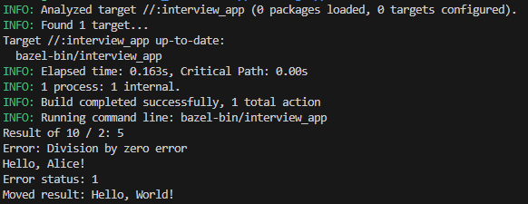
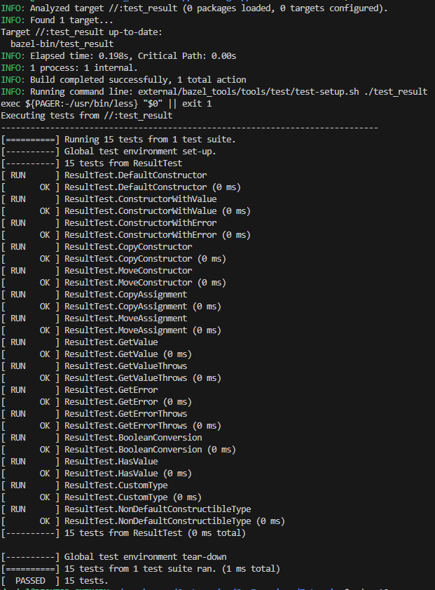

# Result Class

## Overview

`Result` class is generic class template that represents the result of an
operation. It can hold either a value of type `T` or an error of type `E`. This
class is part of the `custom::library` namespace.

`Result` supports `std::variant` introduced in Cpp starting from version 17 and
can be used instead of raw union type. Library can be compiled for C++ version
14 and 17.

## Template Parameters

- `T`: type of the value
- `E`: type of the error (default: `Status` enum class)

## Key Features

- Can store either a value or an error
- Provides methods to access the value or error
- Includes boolean operators to check if the result has a value or an error
- Uses union to store either value or error, optimizing memory usage

## Usage Example

```cpp
Result<int> operation(bool succeed) {
    if (succeed) {
        return 42;
    } else {
        return "Operation failed";
    }
}

auto result = operation(true);
if (result) {
    std::cout << "Value: " << result.getValue() << std::endl;
} else {
    std::cout << "Error: " << result.getError() << std::endl;
}
```

## Limitations:
- Error type should be left for now as default one what is `Status`

## Run targets
To run and test created library you can use `Bazel`

##### Run example
To run the `result` library example usage execute following command:

```
bazel run --cxxopt=-std=c++17 //:example_result
```

Or for Cpp14:

```
bazel run --cxxopt=-std=c++14 //:example_result
```

Example output:



##### Run the tests
To run the `result` library unit tests execute following command:

```
bazel run --cxxopt=-std=c++17 //:test_result
```

Or for Cpp14:

```
bazel run --cxxopt=-std=c++14 //:test_result
```

Example output:

